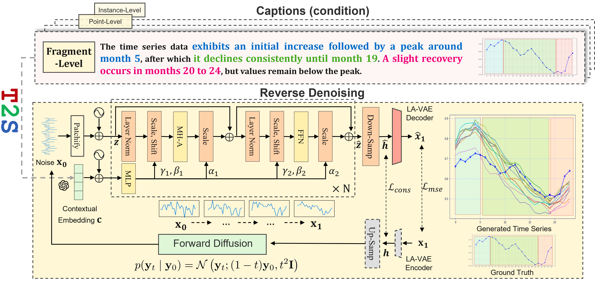

<div align="center">

<h2><b>(IJCAI'25) <span style="color:rgb(185,5,14)">T</span><span style="color:rgb(19,175,85)">2</span><span style="color:rgb(46,96,179)">S</span>: High-resolution Time Series Generation with Text-to-Series Diffusion Models</b></h2>

<p>
  
</p>

<p>
  
  
  
  
</p>

</div>


> ✅ **T2S** is the **first domain-agnostic framework** for text-to-time series generation.  
> 📊 **TSFragment-600K** is the **first** well-aligned, fragment-level text–time series multimodal dataset across 6 classical domains.


## 🗞️ Updates / News

- 🚩 **April 2025**: **T2S** has been accepted by *IJCAI 2025*  
- 🚩 **May 2025**: [**TSFragment-600K**](https://huggingface.co/datasets/WinfredGe/TSFragment-600K) is now available on 🤗 Hugging Face  
- 🚩 **May 2025**: Pretrained models [**T2S-LA-VAE**](https://huggingface.co/WinfredGe/T2S-pretrained_LA-VAE) and [**T2S-DiT**](https://huggingface.co/WinfredGe/T2S-DiT) released  

## 💫 Introduction

**T2S** is the first domain-agnostic model that enables **text-to-time series generation**. It allows users—both non-experts and professionals—to generate high-resolution, semantically aligned time series from natural language descriptions.

- Application Scenarios:

1. **Inclusive Data Interaction**  
   Non-experts can describe temporal behaviors and generate synthetic data, democratizing access to data-driven tools, encouraging broader participation in time series data analysis.

2. **Rapid Prototyping for Professionals**  
   Experts can use simple textual descriptions to quickly simulate system temporal dynamics. This capability supports **rapid prototyping** and analysis of system evolution under different conditions. 

3. **Stress Testing**  
   Simulate edge cases (e.g., "an extreme surge in demand") to evaluate system robustness—beyond what traditional diffusion models can do. Note that traditional models struggle to model these extreme cases because they rely on stationary source data distributions.

<p align="center">
  
</p>

- Key Components

- **T2S-DiT**: A diffusion-based transformer tailored for conditional generation from natural language.
- **LA-VAE**: A pretrained **Length-Adaptive Variational Autoencoder** that supports generation of variable-length series.
- **Dataset: TSFragment-600K**: A large-scale multi-modal dataset with 600K fragment-level text-time series pairs annotated with **fine-grained morphological captions**.

<p align="center">
  
</p>

## 📑 Datasets

- [TSFragment-600K dataset](https://huggingface.co/datasets/WinfredGe/TSFragment-600K) is available on 🤗 Hugging Face.
You can follow the usage example to call TSFragment-600K dataset:
```
from datasets import load_dataset
ds = load_dataset("WinfredGe/TSFragment-600K")
```

- You have access to download all well pre-processed [[three levels datasets]](https://drive.google.com/file/d/1tV0xBd0ToWvuLpI5Ocd49uM3QcRkP4NT/view?usp=sharing)(include TSFragment-600K dataset), then place them under `./Data` directory.
> [!NOTE]
> We also open source the dataset construction and evaluation pipeline under `./Dataset_Construction_Pipeline/`.

- Dataset Structure:
```
Data
├─ TSFragment-600K
│  ├─ embedding_cleaned_airquality_24.csv
│  ├─ embedding_cleaned_airquality_48.csv
│  ├─ embedding_cleaned_airquality_96.csv
│  ├─ embedding_cleaned_electricity_24.csv
│  ├─ embedding_cleaned_electricity_48.csv
│  ├─ embedding_cleaned_electricity_96.csv
│  │ ...
│  ├─ embedding_cleaned_traffic_24.csv
│  ├─ embedding_cleaned_traffic_48.csv
│  └─ embedding_cleaned_traffic_96.csv
├─ SUSHI
│  └─ embedding_cleaned_SUSHI.csv
└─ MMD
   ├─ embedding_cleaned_Agriculture_24.csv
   ├─ embedding_cleaned_Agriculture_48.csv
   ├─ embedding_cleaned_Agriculture_96.csv
   ├─ embedding_cleaned_Climate_24.csv
   ├─ embedding_cleaned_Climate_48.csv
   ├─ embedding_cleaned_Climate_96.csv
   │ ...
   ├─ embedding_cleaned_SocialGood_24.csv
   ├─ embedding_cleaned_SocialGood_48.csv
   └─ embedding_cleaned_SocialGood_96.csv
```


## 🚀 Get Started

### Code Overview
The code structure is as follows:
```
T2S-main
├─ pretrained_lavae_unified.py
├─ train.py
├─ infer.py
├─ evaluation.py
├─ datafactory
│  ├─ dataloader.py
│  └─ dataset.py
├─ model
│  ├─ pretrained
│  │  ├─ core.py
│  │  └─ vqvae.py
│  ├─ denoiser
│  │  ├─ mlp.py
│  │  └─ transformer.py
│  └─ backbone
│     ├─ DDPM.py
│     └─ rectified_flow.py
└─ evaluate
   ├─ feature_based_measures.py
   ├─ ts2vec.py
   └─ utils.py
```
### ① Installation

- Install Python 3.10 from MiniConda, and then install the required dependencies:

```shell
pip install -r requirements.txt
```

**Note: T2S requires `torch==2.3.1` .**

###  ② Prepare Datasets
- You can access all well pre-processed [three level datasets](https://drive.google.com/file/d/1tV0xBd0ToWvuLpI5Ocd49uM3QcRkP4NT/view?usp=sharing).
- You can also download our [*TSFragment-600K* data](https://huggingface.co/datasets/WinfredGe/TSFragment-600K) only.

### ③ Pretrain LA-VAE

- You can access the well pretrained LA-VAE from [T2S checkpoints](https://drive.google.com/file/d/1T-gjPMvnpSFpkkUSZpAeeIqALThOQydT/view?usp=sharing) in the folder `./results/saved_pretrained_models/`
- Running the follow command to pretrain your own LA-VAE on different datasets. For example,
```
python pretrained_lavae_unified.py --dataset_name ETTh1 --save_path 'results/saved_pretrained_models/' --mix_train True
```
For the more detailed customize, please refer to the arg description of each hyperparameter in `pretrained_lavae_unified.py`.

> [!NOTE]
> LA-VAE use mix_train to convert arbitrary length data into the unified representation.

### ④ Train and Inference 
- We provide some train and inference experiment pipeline in `./script.sh`.
- [Example] Running the following command to train and inference on ETTh1.
```
python train.py --dataset_name 'ETTh1'

python infer.py --dataset_name 'ETTh1_24' --cfg_scale 9.0 --total_step 10
python infer.py --dataset_name 'ETTh1_48' --cfg_scale 9.0 --total_step 10
python infer.py --dataset_name 'ETTh1_96' --cfg_scale 9.0 --total_step 10

```
> [!NOTE]
> You can tune the hyperparameters to suit your needs, such as cfg_scale and total_step.
> Please refer to ```train.py``` and ```infer.py``` for more detailed description of customized hyperparameter settings.


### ⑤ Evaluate
- You can evaluate the model using  `./scripts_validation_only.sh` directly.
- According to the configuration of `inferce.py`, set the corresponding hyperparameters of `evaluation`.
- [Example] Running the following evaluation command to evaluate on ETTh1.
```
python evaluation.py --dataset_name 'ETTh1_24' --cfg_scale 9.0 --total_step 10
```
> [!NOTE]
> If you want to evaluate on MRR metric, please set `--run_multi True` in `inferce.py`.


## 📈 Quick Reproduce

1. Install Python 3.10, and then install the dependencies in `requirements.txt`.
2. Download the [*TSFragment-600K* data](https://huggingface.co/datasets/WinfredGe/TSFragment-600K) and [T2S checkpoints](https://drive.google.com/file/d/1T-gjPMvnpSFpkkUSZpAeeIqALThOQydT/view?usp=sharing) to `./`
3. Evaluate the model using  `./scripts_validation_only.sh` directly.


## 📚Further Reading
1, [**EventTSF: Event-Aware Non-Stationary Time Series Forecasting**](https://www.arxiv.org/pdf/2508.13434), *arXiv* 2025.

**Authors**: Yunfeng Ge, Ming Jin, Yiji Zhao, Hongyan Li, Bo Du, Chang Xu, Shirui Pan

```bibtex
@article{ge2025eventtsf,
  title={EventTSF: Event-Aware Non-Stationary Time Series Forecasting},
  author={Ge, Yunfeng and Jin, Ming and Zhao, Yiji and Li, Hongyan and Du, Bo and Xu, Chang and Pan, Shirui},
  journal={arXiv preprint arXiv:2508.13434},
  year={2025}
}
```

2, [**TimeOmni-1: Incentivizing Complex Reasoning with Time Series in Large Language Models**](https://arxiv.org/pdf/2509.24803), *arXiv* 2025.

**Authors**: Tong Guan, Zijie Meng, Dianqi Li, Shiyu Wang, Chao-Han Huck Yang, Qingsong Wen, Zuozhu Liu, Sabato Marco Siniscalchi, Ming Jin, Shirui Pan

```bibtex
@article{guan2025timeomni,
  title={TimeOmni-1: Incentivizing Complex Reasoning with Time Series in Large Language Models},
  author={Guan, Tong and Meng, Zijie and Li, Dianqi and Wang, Shiyu and Yang, Chao-Han Huck and Wen, Qingsong and Liu, Zuozhu and Siniscalchi, Sabato Marco and Jin, Ming and Pan, Shirui},
  journal={arXiv preprint arXiv:2509.24803},
  year={2025}
}
```

3, [**Time-MQA: Time Series Multi-Task Question Answering with Context Enhancement**](https://arxiv.org/pdf/2503.01875), in *ACL* 2025.
[\[HuggingFace\]](https://huggingface.co/Time-MQA)

**Authors**: Yaxuan Kong, Yiyuan Yang, Yoontae Hwang, Wenjie Du, Stefan Zohren, Zhangyang Wang, Ming Jin, Qingsong Wen

```bibtex
@inproceedings{kong2025time,
  title={Time-mqa: Time series multi-task question answering with context enhancement},
  author={Kong, Yaxuan and Yang, Yiyuan and Hwang, Yoontae and Du, Wenjie and Zohren, Stefan and Wang, Zhangyang and Jin, Ming and Wen, Qingsong},
  booktitle={The 63rd Annual Meeting of the Association for Computational Linguistics (ACL 2025)},
  year={2025}
}
```

4, [**A Survey on Diffusion Models for Time Series and Spatio-Temporal Data**](https://arxiv.org/abs/2404.18886), in *ACM Computing Surveys* 2025.
[\[GitHub Repo\]](https://github.com/yyysjz1997/Awesome-TimeSeries-SpatioTemporal-Diffusion-Model/blob/main/README.md)

**Authors**: Yiyuan Yang, Ming Jin, Haomin Wen, Chaoli Zhang, Yuxuan Liang, Lintao Ma, Yi Wang, Chenghao Liu, Bin Yang, Zenglin Xu, Jiang Bian, Shirui Pan, Qingsong Wen

```bibtex
@article{yang2024survey,
  title={A survey on diffusion models for time series and spatio-temporal data},
  author={Yang, Yiyuan and Jin, Ming and Wen, Haomin and Zhang, Chaoli and Liang, Yuxuan and Ma, Lintao and Wang, Yi and Liu, Chenghao and Yang, Bin and Xu, Zenglin and others},
  journal={ACM Computing Surveys},
  year={2025}
}
```

## 🙋 Citation
> Please let us know if you find out a mistake or have any suggestions!
> If you find this resource helpful, please consider to star this repository and cite our research:
```
@inproceedings{ge2025t2s,
  title={T2S: High-resolution Time Series Generation with Text-to-Series Diffusion Models},
  author={Ge, Yunfeng and Li, Jiawei and Zhao, Yiji and Wen, Haomin and Li, Zhao and Qiu, Meikang and Li, Hongyan and Jin, Ming and Pan, Shirui},
  booktitle={International Joint Conference on Artificial Intelligence},
  year={2025}
}
```
## 🌟 Acknowledgement

Our implementation adapts [Time-Series-Library](https://github.com/thuml/Time-Series-Library), [TSGBench](https://github.com/YihaoAng/TSGBench), [TOTEM](https://github.com/SaberaTalukder/TOTEM) and [Meta (Scalable Diffusion Models with Transformers)](https://github.com/facebookresearch/DiT) as the code base and have extensively modified it to our purposes. We thank the authors for sharing their implementations and related resources.

