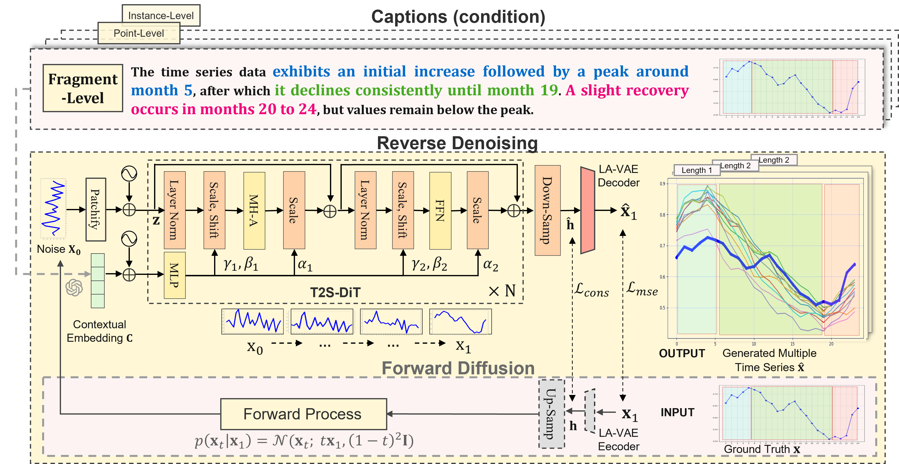
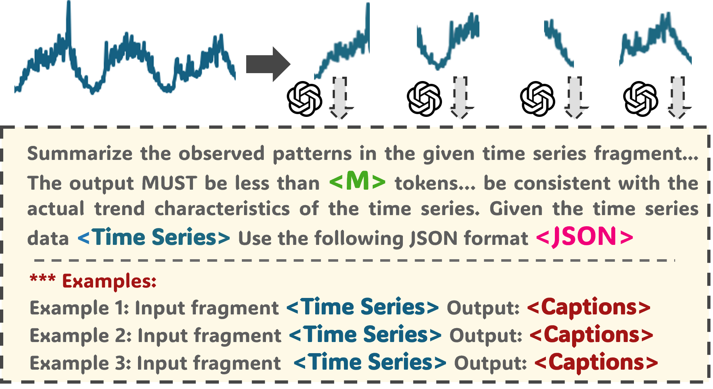

<div align="center">
  <!-- <h1><b> T2S </b></h1> -->
  <!-- <h2><b> T2S </b></h2> -->
  <h2><b> (IJCAI'25) <span style="color:rgb(185,5,14)">T</span><span style="color:rgb(19,175,85)">2</span><span style="color:rgb(46,96,179)">S</span>: High-resolution Time Series Generation with Text-to-Series Diffusion Models </b></h2>
</div>

<div align="center">


</div>

<p align="center">
    
</p>


---
>
>🙋 Please let us know if you find out a mistake or have any suggestions!
>
>🌟 If you find this resource helpful, please consider to star this repository and cite our research:

```
@inproceedings{ge2025t2s,
  title={{T2S}: High-resolution Time Series Generation with Text-to-Series Diffusion Models},
  author={Ge, Yunfeng and Li, Jiawei and Zhao, Yiji and Wen, Haomin and Li, Zhao and Qiu, Meikang and Li, Hongyan and Jin, Ming and Pan, Shirui},
  booktitle={International Joint Conference on Artificial Intelligence (IJCAI)},
  year={2025}
}
```

## Introduction
T2S is the first domain-agnostic model for text-to-time series generation. This allows ordinary people to describe temporal changes without requiring specialized expertise in a particular field. 

Application Scenarios:

 (1) Ordinary people can create time series data and engage with data-driven tools without needing advanced skills. This could encourage **broader participation in data analysis**.

 (2) Professionals can use simple textual descriptions to quickly generate time series data that simulate specific system behaviors. This capability supports **rapid prototyping** and analysis of system evolution under different conditions. 

(3) It can be used for **stress testing** systems, such as creating "an extreme surge in demand" to assess a database’s responsiveness or network elements’  carrying capacity under extreme cases. Note that traditional methods struggle to model these extreme cases because they rely on stationary source data distributions.

<p align="center">

</p>


- T2S comprises two key components: (1) T2S Diffusion Transformer and (2) Pretrained Length-Adaptive Variational Autoencoder,  to empower the capability of generating semantically aligned time series of arbitrary lengths.  
- *TSFragment-600K* comprising over 600,000 fragment-level text-time series pairs. Each captions captures fine-grained temporal morphological characteristics, offering a rich and nuanced representation of the underlying trends.

<p align="center">

</p>


## Video


## Requirements

Use python 3.10 from Conda

- torch==2.3.1
- datasets==2.21.0
- einops==0.7.0
- numpy==1.26.4
- pandas==1.5.3
- scipy==1.14.1
- seaborn==0.13.2
- tqdm==4.66.5
- transformers==4.47.0
- timm==1.0.11
- sentencepiece==0.2.0
- peft==0.10.0
- openai==1.35.9

To install all dependencies:

```shell
pip install -r requirements.txt
```

## Datasets
You can access all well pre-processed three levels datasets from [[Google Drive]](https://drive.google.com/file/d/1tV0xBd0ToWvuLpI5Ocd49uM3QcRkP4NT/view?usp=sharing), then place the downloaded contents under `./`. We also open source the dataset construction and evaluation pipeline [[Dataset Construction Pipeline]](https://drive.google.com/file/d/1fTfE634h_n1JsrLFwl1B3uUH06muHwjw/view?usp=sharing).

## Get Started

1. Install Python 3.10 and PyTorch 2.3.1.
2. Download the [*TSFragment-600K* data](https://drive.google.com/file/d/1YEe66ptAl52yp17MXVO9xWOe5rS1yUyZ/view?usp=sharing) and [checkpoints](https://drive.google.com/file/d/1T-gjPMvnpSFpkkUSZpAeeIqALThOQydT/view?usp=sharing) from Google Drive to `./`
3. Train and perform inference with the model. We provide the experiment script under the  `./script.sh`. (optional)
4. You can evaluate the model using  `./scripts_validation_only.sh` or by:

```shell
python evaluation.py --dataset_name 'exchangerate_24' --cfg_scale 7.0 --total_step 100
python evaluation.py --dataset_name 'exchangerate_48' --cfg_scale 12.0 --total_step 60
python evaluation.py --dataset_name 'exchangerate_96' --cfg_scale 5.0 --total_step 100

python evaluation.py --dataset_name 'electricity_24' --cfg_scale 5.0 --total_step 60
python evaluation.py --dataset_name 'electricity_48' --cfg_scale 5.0 --total_step 10
python evaluation.py --dataset_name 'electricity_96' --cfg_scale 13.0 --total_step 30


python evaluation.py --dataset_name 'traffic_24' --cfg_scale 5.0 --total_step 100
python evaluation.py --dataset_name 'traffic_48' --cfg_scale 5.0 --total_step 10
python evaluation.py --dataset_name 'traffic_96' --cfg_scale 5.0 --total_step 30

python evaluation.py --dataset_name 'ETTh1_24' --cfg_scale 9.0 --total_step 10
python evaluation.py --dataset_name 'ETTh1_48' --cfg_scale 9.0 --total_step 10
python evaluation.py --dataset_name 'ETTh1_96' --cfg_scale 9.0 --total_step 10
```

`

## Detailed usage

Please refer to ```pretrained_lavae_unified.py```, ```train.py```, ```infer.py``` and ```evaluation.py``` for the detailed description of each hyperparameter.

## Further Reading
1, [**TimeMixer++: A General Time Series Pattern Machine for Universal Predictive Analysis**](https://arxiv.org/abs/2410.16032), in *arXiv* 2024.
[\[GitHub Repo\]](https://github.com/kwuking/TimeMixer/blob/main/README.md)

**Authors**: Shiyu Wang, Jiawei Li, Xiaoming Shi, Zhou Ye, Baichuan Mo, Wenze Lin, Shengtong Ju, Zhixuan Chu, Ming Jin

```bibtex
@article{wang2024timemixer++,
  title={TimeMixer++: A General Time Series Pattern Machine for Universal Predictive Analysis},
  author={Wang, Shiyu and Li, Jiawei and Shi, Xiaoming and Ye, Zhou and Mo, Baichuan and Lin, Wenze and Ju, Shengtong and Chu, Zhixuan and Jin, Ming},
  journal={arXiv preprint arXiv:2410.16032},
  year={2024}
}
```

2, [**Foundation Models for Time Series Analysis: A Tutorial and Survey**](https://arxiv.org/pdf/2403.14735), in *KDD* 2024.

**Authors**: Yuxuan Liang, Haomin Wen, Yuqi Nie, Yushan Jiang, Ming Jin, Dongjin Song, Shirui Pan, Qingsong Wen*

```bibtex
@inproceedings{liang2024foundation,
  title={Foundation models for time series analysis: A tutorial and survey},
  author={Liang, Yuxuan and Wen, Haomin and Nie, Yuqi and Jiang, Yushan and Jin, Ming and Song, Dongjin and Pan, Shirui and Wen, Qingsong},
  booktitle={ACM SIGKDD Conference on Knowledge Discovery and Data Mining (KDD 2024)},
  year={2024}
}
```

3, [**Position Paper: What Can Large Language Models Tell Us about Time Series Analysis**](https://arxiv.org/abs/2402.02713), in *ICML* 2024.

**Authors**: Ming Jin, Yifan Zhang, Wei Chen, Kexin Zhang, Yuxuan Liang*, Bin Yang, Jindong Wang, Shirui Pan, Qingsong Wen*

```bibtex
@inproceedings{jin2024position,
   title={Position Paper: What Can Large Language Models Tell Us about Time Series Analysis}, 
   author={Ming Jin and Yifan Zhang and Wei Chen and Kexin Zhang and Yuxuan Liang and Bin Yang and Jindong Wang and Shirui Pan and Qingsong Wen},
  booktitle={International Conference on Machine Learning (ICML 2024)},
  year={2024}
}
```

4, [**Large Models for Time Series and Spatio-Temporal Data: A Survey and Outlook**](https://arxiv.org/abs/2310.10196), in *arXiv* 2023.
[\[GitHub Repo\]](https://github.com/qingsongedu/Awesome-TimeSeries-SpatioTemporal-LM-LLM)

**Authors**: Ming Jin, Qingsong Wen*, Yuxuan Liang, Chaoli Zhang, Siqiao Xue, Xue Wang, James Zhang, Yi Wang, Haifeng Chen, Xiaoli Li (IEEE Fellow), Shirui Pan*, Vincent S. Tseng (IEEE Fellow), Yu Zheng (IEEE Fellow), Lei Chen (IEEE Fellow), Hui Xiong (IEEE Fellow)

```bibtex
@article{jin2023lm4ts,
  title={Large Models for Time Series and Spatio-Temporal Data: A Survey and Outlook}, 
  author={Ming Jin and Qingsong Wen and Yuxuan Liang and Chaoli Zhang and Siqiao Xue and Xue Wang and James Zhang and Yi Wang and Haifeng Chen and Xiaoli Li and Shirui Pan and Vincent S. Tseng and Yu Zheng and Lei Chen and Hui Xiong},
  journal={arXiv preprint arXiv:2310.10196},
  year={2023}
}
```


5, [**Transformers in Time Series: A Survey**](https://arxiv.org/abs/2202.07125), in IJCAI 2023.
[\[GitHub Repo\]](https://github.com/qingsongedu/time-series-transformers-review)

**Authors**: Qingsong Wen, Tian Zhou, Chaoli Zhang, Weiqi Chen, Ziqing Ma, Junchi Yan, Liang Sun

```bibtex
@inproceedings{wen2023transformers,
  title={Transformers in time series: A survey},
  author={Wen, Qingsong and Zhou, Tian and Zhang, Chaoli and Chen, Weiqi and Ma, Ziqing and Yan, Junchi and Sun, Liang},
  booktitle={International Joint Conference on Artificial Intelligence(IJCAI)},
  year={2023}
}
```

6, [**TimeMixer: Decomposable Multiscale Mixing for Time Series Forecasting**](https://openreview.net/pdf?id=7oLshfEIC2), in ICLR 2024.
[\[GitHub Repo\]](https://github.com/kwuking/TimeMixer)

**Authors**: Shiyu Wang, Haixu Wu, Xiaoming Shi, Tengge Hu, Huakun Luo, Lintao Ma, James Y. Zhang, Jun Zhou 

```bibtex
@inproceedings{wang2023timemixer,
  title={TimeMixer: Decomposable Multiscale Mixing for Time Series Forecasting},
  author={Wang, Shiyu and Wu, Haixu and Shi, Xiaoming and Hu, Tengge and Luo, Huakun and Ma, Lintao and Zhang, James Y and ZHOU, JUN},
  booktitle={International Conference on Learning Representations (ICLR)},
  year={2024}
}
```

## Acknowledgement
Our implementation adapts [Time-Series-Library](https://github.com/thuml/Time-Series-Library), [TSGBench](https://github.com/YihaoAng/TSGBench), [TOTEM](https://github.com/SaberaTalukder/TOTEM) and [Meta (Scalable Diffusion Models with Transformers)](https://github.com/facebookresearch/DiT) as the code base and have extensively modified it to our purposes. We thank the authors for sharing their implementations and related resources.
