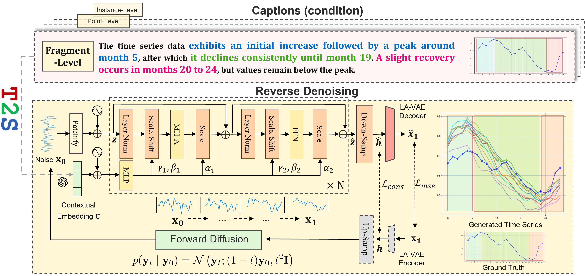
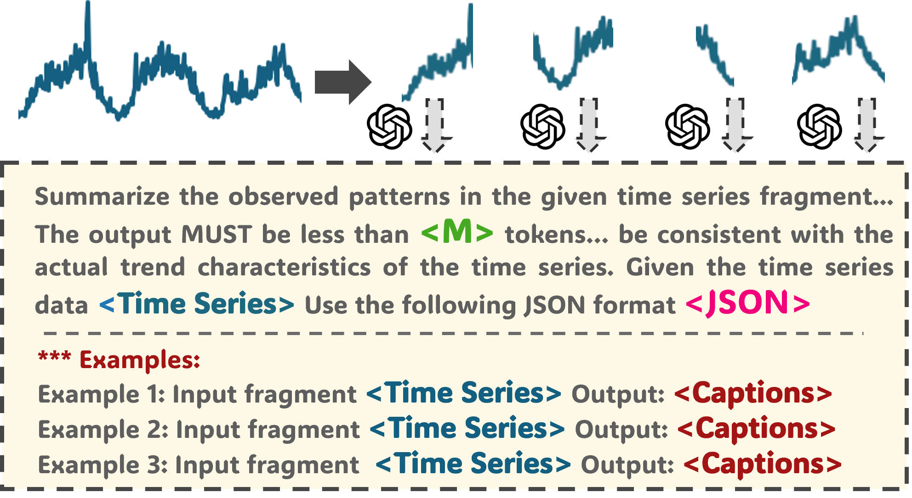

<div align="center">

<h2><b>(IJCAI'25) <span style="color:rgb(185,5,14)">T</span><span style="color:rgb(19,175,85)">2</span><span style="color:rgb(46,96,179)">S</span>: High-resolution Time Series Generation with Text-to-Series Diffusion Models</b></h2>

<p>
  
</p>

<p>
  
  
  
  
</p>

</div>

> ✅ **T2S** 是首个**领域无关**的文本生成时间序列框架  
> 📊 **TSFragment-600K** 是首个**跨 6 个经典领域**、片段级文本-时间序列对齐数据集

## 🗞️ 更新 / News

- 🚩 **April 2025**：**T2S** 被 *IJCAI 2025* 接收  
- 🚩 **May 2025**：[**TSFragment-600K**](https://huggingface.co/datasets/WinfredGe/TSFragment-600K) 已发布在 🤗 Hugging Face  
- 🚩 **May 2025**：预训练模型 [**T2S-LA-VAE**](https://huggingface.co/WinfredGe/T2S-pretrained_LA-VAE) 与 [**T2S-DiT**](https://huggingface.co/WinfredGe/T2S-DiT) 已发布

## 💫 项目简介

**T2S** 面向文本到时间序列生成任务，能够从自然语言描述中生成高分辨率、语义对齐的时间序列，面向非专家与专业用户提供统一的生成能力。

**应用场景**

1. **普惠式数据交互**：非专家可用语言描述生成合成序列，降低数据分析门槛  
2. **专业场景快速原型**：用简短描述快速模拟系统演化，用于原型验证与分析  
3. **极端情境压力测试**：模拟极端波动与异常事件，评估系统鲁棒性

<p align="center">
  
</p>

## 🔧 模型与数据集

- **T2S-DiT**：面向文本条件的扩散式 Transformer  
- **LA-VAE**：长度自适应变分自编码器，支持可变长度序列  
- **TSFragment-600K**：60 万片段级文本-时间序列对，包含细粒度形态描述

<p align="center">
  
</p>

## 📑 数据集

- 直接在 🤗 Hugging Face 获取：  
  - [TSFragment-600K](https://huggingface.co/datasets/WinfredGe/TSFragment-600K)
```
from datasets import load_dataset
ds = load_dataset("WinfredGe/TSFragment-600K")
```

- 可下载包含三层级数据的预处理包（含 TSFragment-600K），并放在 `./Data`：  
  - [预处理数据集下载链接](https://drive.google.com/file/d/1tV0xBd0ToWvuLpI5Ocd49uM3QcRkP4NT/view?usp=sharing)

> [!NOTE]
> 数据集构建与评测流程位于 `./Dataset_Construction_Pipeline/`。

**数据结构**
```
Data
├─ TSFragment-600K
│  ├─ embedding_cleaned_airquality_24.csv
│  ├─ embedding_cleaned_airquality_48.csv
│  ├─ embedding_cleaned_airquality_96.csv
│  │ ...
├─ SUSHI
│  └─ embedding_cleaned_SUSHI.csv
└─ MMD
   ├─ embedding_cleaned_Agriculture_24.csv
   ├─ embedding_cleaned_Agriculture_48.csv
   ├─ embedding_cleaned_Agriculture_96.csv
   │ ...
```

## 🚀 快速开始

### ① 安装

```
pip install -r requirements.txt
```

> [!NOTE]
> 需要 `torch==2.3.1`。

### ② 数据准备

- 下载三层级预处理数据或仅下载 [TSFragment-600K](https://huggingface.co/datasets/WinfredGe/TSFragment-600K)
- 将数据放在 `./Data` 目录

### ③ 预训练 LA-VAE

- 预训练模型下载：[T2S checkpoints](https://drive.google.com/file/d/1T-gjPMvnpSFpkkUSZpAeeIqALThOQydT/view?usp=sharing)，放至 `./results/saved_pretrained_models/`
- 自行预训练示例：
```
python pretrained_lavae_unified.py --dataset_name ETTh1 --save_path 'results/saved_pretrained_models/' --mix_train True
```

> [!NOTE]
> `mix_train` 会将不同长度序列统一到同一表示空间。

### ④ 训练与推理

- 脚本示例见 `./scripts/script.sh`
- 示例（ETTh1）：
```
python train.py --dataset_name 'ETTh1'

python infer.py --dataset_name 'ETTh1_24' --cfg_scale 9.0 --total_step 10
python infer.py --dataset_name 'ETTh1_48' --cfg_scale 9.0 --total_step 10
python infer.py --dataset_name 'ETTh1_96' --cfg_scale 9.0 --total_step 10
```

### ⑤ 评测

- 评测脚本见 `./scripts/scripts_validation_only.sh`
- 示例（ETTh1）：
```
python evaluation.py --dataset_name 'ETTh1_24' --cfg_scale 9.0 --total_step 10
```

> [!NOTE]
> 若需评测 MRR，请在 `infer.py` 中设置 `--run_multi True`。

## 📈 快速复现

1. 安装 Python 3.10 与依赖  
2. 下载 [TSFragment-600K](https://huggingface.co/datasets/WinfredGe/TSFragment-600K) 与 [T2S checkpoints](https://drive.google.com/file/d/1T-gjPMvnpSFpkkUSZpAeeIqALThOQydT/view?usp=sharing) 到项目根目录  
3. 运行 `./scripts/scripts_validation_only.sh` 进行评测

## 📚 进一步阅读

1. [**EventTSF: Event-Aware Non-Stationary Time Series Forecasting**](https://www.arxiv.org/pdf/2508.13434), *arXiv* 2025.
```
@article{ge2025eventtsf,
  title={EventTSF: Event-Aware Non-Stationary Time Series Forecasting},
  author={Ge, Yunfeng and Jin, Ming and Zhao, Yiji and Li, Hongyan and Du, Bo and Xu, Chang and Pan, Shirui},
  journal={arXiv preprint arXiv:2508.13434},
  year={2025}
}
```

2. [**TimeOmni-1: Incentivizing Complex Reasoning with Time Series in Large Language Models**](https://arxiv.org/pdf/2509.24803), *arXiv* 2025.
```
@article{guan2025timeomni,
  title={TimeOmni-1: Incentivizing Complex Reasoning with Time Series in Large Language Models},
  author={Guan, Tong and Meng, Zijie and Li, Dianqi and Wang, Shiyu and Yang, Chao-Han Huck and Wen, Qingsong and Liu, Zuozhu and Siniscalchi, Sabato Marco and Jin, Ming and Pan, Shirui},
  journal={arXiv preprint arXiv:2509.24803},
  year={2025}
}
```

3. [**Time-MQA: Time Series Multi-Task Question Answering with Context Enhancement**](https://arxiv.org/pdf/2503.01875), in *ACL* 2025. [\[HuggingFace\]](https://huggingface.co/Time-MQA)
```
@inproceedings{kong2025time,
  title={Time-mqa: Time series multi-task question answering with context enhancement},
  author={Kong, Yaxuan and Yang, Yiyuan and Hwang, Yoontae and Du, Wenjie and Zohren, Stefan and Wang, Zhangyang and Jin, Ming and Wen, Qingsong},
  booktitle={The 63rd Annual Meeting of the Association for Computational Linguistics (ACL 2025)},
  year={2025}
}
```

4. [**A Survey on Diffusion Models for Time Series and Spatio-Temporal Data**](https://arxiv.org/abs/2404.18886), in *ACM Computing Surveys* 2025. [\[GitHub Repo\]](https://github.com/yyysjz1997/Awesome-TimeSeries-SpatioTemporal-Diffusion-Model/blob/main/README.md)
```
@article{yang2024survey,
  title={A survey on diffusion models for time series and spatio-temporal data},
  author={Yang, Yiyuan and Jin, Ming and Wen, Haomin and Zhang, Chaoli and Liang, Yuxuan and Ma, Lintao and Wang, Yi and Liu, Chenghao and Yang, Bin and Xu, Zenglin and others},
  journal={ACM Computing Surveys},
  year={2025}
}
```

## 🙋 引用

如果该项目对你有帮助，欢迎 star，并引用如下：
```
@inproceedings{ge2025t2s,
  title={T2S: High-resolution Time Series Generation with Text-to-Series Diffusion Models},
  author={Ge, Yunfeng and Li, Jiawei and Zhao, Yiji and Wen, Haomin and Li, Zhao and Qiu, Meikang and Li, Hongyan and Jin, Ming and Pan, Shirui},
  booktitle={International Joint Conference on Artificial Intelligence},
  year={2025}
}
```

## 🌟 致谢

本项目基于 [Time-Series-Library](https://github.com/thuml/Time-Series-Library)、[TSGBench](https://github.com/YihaoAng/TSGBench)、[TOTEM](https://github.com/SaberaTalukder/TOTEM) 与 [Meta (Scalable Diffusion Models with Transformers)](https://github.com/facebookresearch/DiT) 并进行扩展实现，感谢相关作者的开源贡献。
